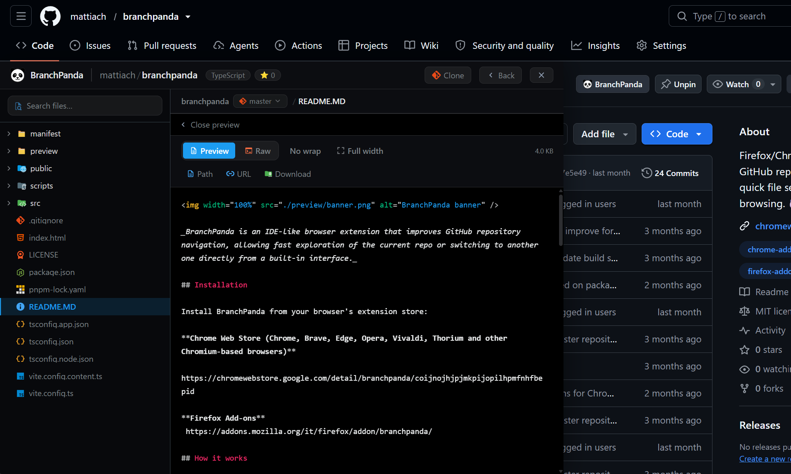

<h1 align="center">BranchPanda 🐼</h1>

<p align="center">
  <strong>An IDE-like file explorer for GitHub, right inside your browser.</strong><br />
  Browse any public repository — tree view, instant file search, syntax highlighting, branch switching — without leaving the page you are on.
</p>

<p align="center">
  <a href="https://chromewebstore.google.com/detail/branchpanda/coijnojhjpjmkpijopilhpmfnhfbepid"></a>
  <a href="https://addons.mozilla.org/firefox/addon/branchpanda/"></a>
  
  
</p>

---

## Why BranchPanda

GitHub's web UI reloads a full page for every folder you open. BranchPanda loads the repository tree once and keeps it in a sidebar, so jumping between files feels like working in an editor — no page reloads, no losing your place.

|                             |                                                                                        |
| --------------------------- | -------------------------------------------------------------------------------------- |
| 🗂️ **Tree explorer**        | Full repository tree, lazy-loaded and cached, with 900+ file-type icons                |
| 🔎 **Fuzzy file search**    | Type part of a path, get the file — fuzzy matching across the whole tree               |
| 🎨 **Syntax highlighting**  | Prism-powered highlighting with line numbers, wrap toggle and Markdown preview         |
| 🔤 **In-file search**       | <kbd>Ctrl</kbd>/<kbd>Cmd</kbd> + <kbd>F</kbd> inside the viewer, with match navigation |
| 🌿 **Branch switcher**      | Switch branch from the breadcrumbs; your last branch is remembered per repository      |
| 🖼️ **Image preview**        | Images render inline instead of downloading                                            |
| ↔️ **Resizable sidebar**    | Drag to resize, or expand to full width; the size is remembered                        |
| 🕘 **Recent repositories**  | Recently opened repos are one click away from the home screen                          |
| 📋 **Quick actions**        | Copy file path, copy file URL, download file, copy the `git clone` command             |
| ⚡ **No account, no token** | Anonymous GitHub API access — nothing to sign in to                                    |

---

## Installation

Install from your browser's extension store — two clicks, no build step:

| Browser                                                                      | Store                                                                                                     |
| ---------------------------------------------------------------------------- | --------------------------------------------------------------------------------------------------------- |
| **Chrome, Brave, Edge, Opera, Vivaldi, Thorium** and other Chromium browsers | [Chrome Web Store](https://chromewebstore.google.com/detail/branchpanda/coijnojhjpjmkpijopilhpmfnhfbepid) |
| **Firefox**                                                                  | [Firefox Add-ons](https://addons.mozilla.org/firefox/addon/branchpanda/)                                  |

---

## How it works

On any public repository page, BranchPanda injects a **BranchPanda** button into the repository header:

Clicking it slides in the explorer panel over the page — file tree on the left, file viewer on the right:



From there you can:

- Browse the repository with a fast, structured file explorer
- Search files by name, or search inside the file you are viewing
- Switch branches and pick up where you left off (the last branch is stored per repository)
- Preview images and rendered Markdown directly in the panel
- Navigate folders via clickable breadcrumbs
- Reopen recent repositories, or open any other repo by typing `owner` and `repo`

The panel also works as a standalone popup from the browser toolbar, so you can explore a repository from any tab.

---

## 🔒 Private repositories

**BranchPanda supports public repositories only.**

This is a deliberate design choice: the extension requests no authentication, stores no token, and holds no `permissions` in its manifest — it only talks to the public GitHub API. That keeps the security surface close to zero. If private-repository support matters for your use case, you are welcome to fork the project and implement it.

### What it stores

Everything lives in your browser's `localStorage` under the `branchpanda_` prefix: API responses (5-minute TTL cache), UI preferences, the last branch per repository, and the list of recent repositories. Nothing is sent anywhere except `api.github.com` and `raw.githubusercontent.com`.

---

## Tech stack

|                  |                                                                              |
| ---------------- | ---------------------------------------------------------------------------- |
| **UI**           | [Preact](https://preactjs.com/) + TypeScript                                 |
| **Styling**      | [Tailwind CSS v4](https://tailwindcss.com/)                                  |
| **Animation**    | [Motion](https://motion.dev/)                                                |
| **Highlighting** | [Prism.js](https://prismjs.com/)                                             |
| **Build**        | [Vite](https://vite.dev/) — two builds: the popup app and the content script |
| **Platform**     | Manifest V3, Chrome + Firefox                                                |

---

## Development

### Prerequisites

Install [Node.js](https://nodejs.org/) and [pnpm](https://pnpm.io/installation), then:

```bash
pnpm install
```

### Scripts

| Script                   | What it does                                                          |
| ------------------------ | --------------------------------------------------------------------- |
| `pnpm dev`               | Runs the panel as a plain web app in Vite's dev server                |
| `pnpm build:chrome`      | Type-checks, builds, and copies the **Chrome** manifest into `dist/`  |
| `pnpm build:firefox`     | Type-checks, builds, and copies the **Firefox** manifest into `dist/` |
| `pnpm version:manifests` | Syncs both manifest versions with `package.json`                      |

The extension code is identical across browsers — only the manifest differs.

### Loading the unpacked build

- **Chrome / Edge / Brave:** open `chrome://extensions`, enable **Developer mode**, click **Load unpacked**, select `dist/`.
- **Firefox:** open `about:debugging` → **This Firefox** → **Load Temporary Add-on**, select `dist/manifest.json`.

> Just want to use it? Grab the published build from the **[Chrome Web Store](https://chromewebstore.google.com/detail/branchpanda/coijnojhjpjmkpijopilhpmfnhfbepid)** or **[Firefox Add-ons](https://addons.mozilla.org/firefox/addon/branchpanda/)** — installation takes two clicks. 🐼

---

## Contributing

Issues and pull requests are welcome. Keep changes focused, run `pnpm build:chrome` before opening a PR (it type-checks the whole project), and describe the browser you tested on.

## Author

**mattiach** — [GitHub](https://github.com/mattiach) · [LinkedIn](https://www.linkedin.com/in/mattiach/)

## License

MIT — see [LICENSE](./LICENSE).
