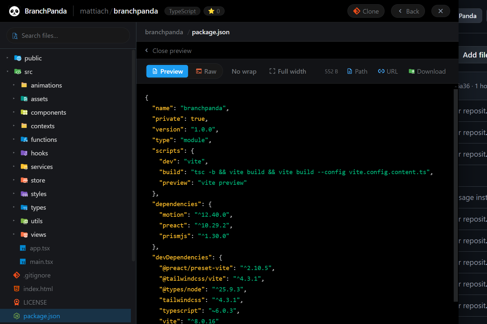

_BranchPanda is an IDE-like browser extension that improves GitHub repository navigation, allowing fast exploration of the current repo or switching to another one directly from a built-in interface._

## How it works

The extension runs inside public GitHub repositories. Clicking the **“BranchPanda”** button in the repository header opens an IDE-like navigation panel.




From there you can:

- Browse the current repository with a fast, structured file explorer
- Switch between branches and pick up where you left off (your last branch is remembered per repository)
- Preview images directly in the file panel
- Navigate folders via clickable breadcrumbs
- Quickly reopen recent repositories from the home screen
- Switch to another repository by entering:
  - GitHub username
  - Repository name

This enables quick context switching between projects without leaving GitHub.

## 🔒 Private repositories

**BranchPanda currently supports only public repositories.**

This restriction is a deliberate design choice aimed at keeping the project simple and minimizing security risks associated with handling private repository access. If support for private repositories is important for your use case, you are welcome to fork the project and implement the required functionality independently.

## Development

### Prerequisites

Install [Node.js](https://nodejs.org/) and [pnpm](https://pnpm.io/installation), then install the project dependencies:

```bash
pnpm install
```

### Available scripts

| Script            | Command              | What it does                                                                                                                                  |
| ----------------- | -------------------- | --------------------------------------------------------------------------------------------------------------------------------------------- |
| **build:chrome**  | `pnpm build:chrome`  | Builds the extension and copies the Chrome manifest into `dist/`. **Use this if you use Chrome, Brave, or any other Chromium-based browser.** |
| **build:firefox** | `pnpm build:firefox` | Builds the extension and copies the Firefox manifest into `dist/`. **Use this if you use Firefox.**                                           |

### Which build command should I use?

The extension code is the same for every browser. The only difference is the manifest file, which each browser reads slightly differently.

- **Chromium browsers** (Chrome, Brave, Thorium, Vivaldi, etc.) → run `pnpm build:chrome`
- **Firefox** → run `pnpm build:firefox`

After the build finishes, load the `dist/` folder as an unpacked extension in your browser:

- **Chrome / Edge / Brave:** open `chrome://extensions` (or the equivalent page in your browser), enable **Developer mode**, then click **Load unpacked** and select the `dist/` folder.
- **Firefox:** open `about:debugging`, click **This Firefox**, then **Load Temporary Add-on** and select any file inside the `dist/` folder (for example `manifest.json`).

## Author

- [LinkedIn](https://www.linkedin.com/in/mattiach/)
- [GitHub](https://github.com/mattiach)

## License

MIT License - see LICENSE file for details
